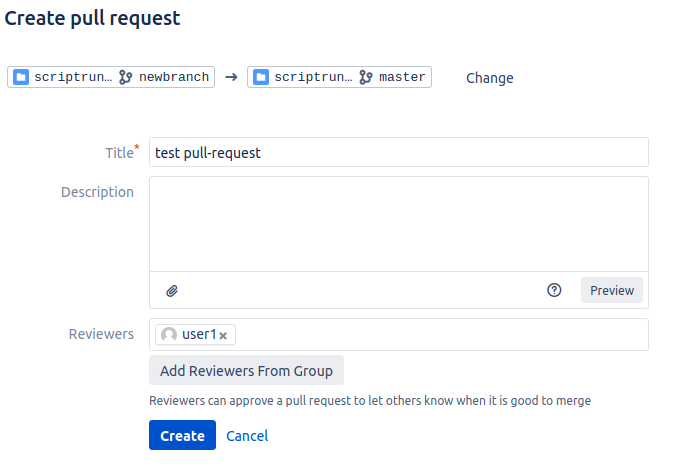
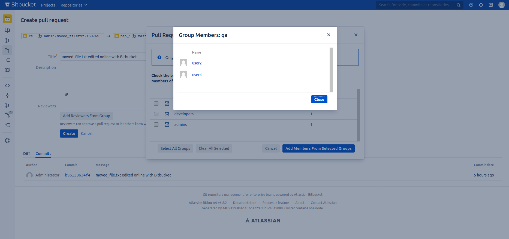

# Pull Request Group Reviewers for Bitbucket Server

## Introduction

A Bitbucket Server plugin which enables users to add reviewers to a pull-request from a group.

This plugin adds a button to the Pull Request Creation form & Edit Pull-Request Dialog: *"Add Reviewers From Group"*
Clicking on this button will open a dialog with a list of groups that has permission to the repository & project.

The user can check a box next to each group (or select all). Members from each group will be added into the reviewers field.

### Screenshots

**The Button**



**Select Group Dialog**


 
**Group Info Dialog**



## Getting Started

You can install this plugin from the Atlassian Market place: <LINK_TO_BE_PROVIDED_ON_APPROVAL>.

Alternatively to build this plugin, clone & change into the root directory, then run `atlas-package` You will find the plugin in ./target/prgroup-x-x-x.jar

On Bitbucket, go to Manage Applications in the admin area and upload the jar file.

To debug this plugin, run `atlas-debug`

## API

This plugin adds two API endpoints to the Bitbucket instance:

**Groups & Group Members which have permission to a repository**

```
GET: BITBUCKET_URL/rest/prgroup/1.0/{projectKey}/{repositorySlug}
```

This is necessary for the UI. The calling user must have READ access to `{projectKey}/{repositorySlug}`, 
it returns a list of groups which have direct permission to either the project or repository and the group
members.

*Note, without this endpoint this information is usually only visible to repository/project administrators.
You should decide whether this information being available to users is a concern for your environment.*


**Pull-Request Reviewer Group Configuration**

Configuration for this plugin. This requires global administrator permission.
There is a UI in Site Admin -> Pull Request Groups

```
GET: BITBUCKET_URL/bitbucket/rest/prgroup/1.0/config
POST: BITBUCKET_URL/bitbucket/rest/prgroup/1.0/config

Example Response & Request:
{
  "max_group_size": 30,
  "hide_truncated_groups": false
}
```

## Configuration

A Global Administrator may configure the plugin by going to the Site Admin -> Pull Request Groups.

| Param  | Description  |  Default Value 
|---|---|---|
| Max Group Size | Limit for the the amount of members in a group can contain to be selectable a reviewer group. | 30
| Hide Truncated Groups | Groups containing an amount of members over Max Group size will be hidden rather than disabled | False

The Max Group Size is to prevent the user for selecting extremely large groups as reviewers. A small but sensible default value has been chosen.


## Supported Versions

This plugin has been manually tested on the following Bitbucket Server Versions.
Tested on Firefox 78 - Other browsers _should_ work too, otherwise raise an issue on Github.

| Bitbucket Version  | Plugin Version | Config | Creating PR | Editing PR |
|---|---|---|---|---|
| 6.0.11 | 0.3.2 | :heavy_check_mark: | :heavy_check_mark: | :heavy_check_mark: |
| 6.1.9 | 0.3.2 | :heavy_check_mark: | :heavy_check_mark: | :heavy_check_mark: |
| 6.2.7 | 0.3.2 | :heavy_check_mark: | :heavy_check_mark: | :heavy_check_mark: |
| 6.3.6 | 0.3.2 | :heavy_check_mark: | :heavy_check_mark: | :heavy_check_mark: |
| 6.4.4 | 0.3.2 | :heavy_check_mark: | :heavy_check_mark: | :heavy_check_mark: |
| 6.5.3 | 0.3.2 | :heavy_check_mark: | :heavy_check_mark: | :heavy_check_mark: |
| 6.6.4 | 0.3.2 | :heavy_check_mark: | :heavy_check_mark: | :heavy_check_mark: |
| 6.7.5 | 0.3.2 | :heavy_check_mark: | :heavy_check_mark: | :heavy_check_mark: |
| 6.8.4 | 0.3.2 | :heavy_check_mark: | :heavy_check_mark: | :heavy_check_mark: |
| 6.9.3 | 0.3.2 | :heavy_check_mark: | :heavy_check_mark: | :heavy_check_mark: |  
| 6.10.5 | 0.3.2 | :heavy_check_mark: | :heavy_check_mark: | :heavy_check_mark: |
| 7.0.5 | 0.3.2 | :heavy_check_mark: | :heavy_check_mark: | :heavy_check_mark: |
| 7.1.4 | 0.3.2 | :heavy_check_mark: | :heavy_check_mark: | :heavy_check_mark: |
| 7.2.5 | 0.3.2 | :heavy_check_mark: | :heavy_check_mark: | :heavy_check_mark: |
| 7.3.1 | 0.3.2 | :heavy_check_mark: | :heavy_check_mark: | :heavy_check_mark: |
| 7.4.0 | 0.3.2 | :heavy_check_mark: | :heavy_check_mark: | :heavy_check_mark: |

This plugin may work on other versions of Bitbucket Server. Bitbucket version 6 & 7 are supported, it has not been tested on Bitbucket 5.

Additionally, this plugin has been running on a production Bitbucket Data Center 7.1.2 for several months without issue.

This plugin works on both Data Center & Server versions of Bitbucket.

## Troubleshooting

This is primarily a client-side plugin, very little happens server-side.

**Only groups which have been assigned permission directly to either the project or repository will be shown in the dialog.** 

If you have any issues with this plugin, just raise an issue on Github.
