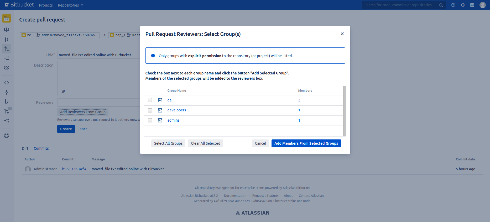

# Pull Request Group Reviewers for Bitbucket Server

## Introduction
A Bitbucket plugin which adds a button to the Pull Request Creation Page.
Clicking this button will open a dialog with a list of groups that have permission to the repository or project.

The user can check a box next to each group (or click select all). Members from each group will be added as a reviewer.
    
Within the dialog, the user can click on the group name to see a list of members in the group.

**Important Note**
Groups containing more members than the value hardcoded in PluginProperties -> `MAX_MEMBERS_IN_GROUP` will return a 
flag 'members_truncated' and cannot be added as reviewers to the pull-request. This is a fail-safe to prevent
users adding extremely large groups to reviewers.

### Screenshots

**The Button**

**Select Group Dialog**

 
**Group Info Dialog**

## Getting Started

To build this plugin, clone & change into the root directory, then run atlas-package You will find the plugin in ./target/prgroup-x-x-x.jar

On Bitbucket, go to Manage Applications in the admin area and upload the jar file.